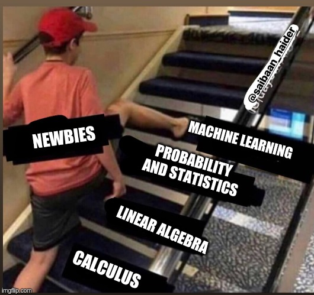

This is the Roadmap I am following for Machine Learning. My personal view is as follow:

 

## What we usually do?
 

We usually get carried away by hearing buzz-words Machine Learning, Deep learning, and Artificial Intelligence, etc. We directly dive into coding Deep Learning Projects without having background knowledge of the algorithms and math used behind the scenes(at least this is the mistake I did at first). We usually see many articles and courses about "Learn Machine learning without Math" etc.

 Here, We need to understand that there is <b>No</b> Machine learning without math. Mathematics is the soul of Machine Learning and AI because it provides ways to implement the algorithms in these very fields. In this way, we head straight towards Machine Learning techniques without learning Pre-Requisites.

  

## Why math is important ?

Earlier, I used to fear mathematics A Lot. I wanted to skip Mathematical Part and dive into this field. But, After reading articles, suggestions from friends, facing problems which were inevitable and impossible for me to solve without the knowledge of the core concept behind this, What I learned is that, there is no escaping mathematics if you want to make a career in AI, ML or DL. You have to note that "If you think that you can skip the mathematics and start learning Machine Learning, then you are very much mistaken". When we start training models without mathematical knowledge using high level, easy to use APIs (TensorFlow, Keras, PyTorch, etc), there comes a phase when are stuck at some accuracy of the model and we are unable to tweak the model, change hyperparameters to increase the accuracy in our model. In high-level APIs, if we don't have any information about the implementation of the algorithms they implemented, how would you expect yourself to fix any problem when faced. If you just want to train models and use them, It's okay to skip the math but to have complete control over models and the algorithms and knowledge of modifying the algorithms according to our need, We need Maths. because in real-world application development, We will never have ideal Data, ideal problems. Sometimes, we have to think out of those boundaries which these API set and modify the algorithms to fit our problems and make a better and efficient product.

 

## Why its worth spending time ?

So for getting ready for this AI and ML adventure, We will need time, patience and lot of practice. 

`Give me six hours to chop down a tree and I will spend the first four sharpening the axe.`

~Abraham Lincoln

This quote is self-explanatory.

Some key points:
* Don't rush into things very fast, It will need time to understand new things
* Always understand the intuition behind the topic
* If anything is tough to understand: 
    * Ask someone with expertise.
    * Search on the internet about it.
    * Find alternative resources.
    * Join online forums and discuss with others.
    * Don't move ahead until you are sure that you have a good understanding of the topics

## Roadmap For Machine Learning : Part 1

For getting ready to efficiently code machine learning models first we need following things to learn first:

 
> ### 1. Linear algebra

Linear Algebra is the integral part of machine learning. The basic Foundation of machine learning is Linear algebra. 

`Linear Algebra is the mathematics of the 21st century`

~Skyler Speakman

For linear algebra, 
* [Essence of linear algebra Video series](https://www.youtube.com/playlist?list=PLZHQObOWTQDPD3MizzM2xVFitgF8hE_ab)
    
<em>These videos will help in visualising the linear algebric concepts. A geometric understanding of matrices, determinants, eigen-stuffs and more. In these, There is no proof, No math, just helps in understand the key idea behind linear algebra. And the guy has done fantastic job</em>

* Basic : 
    * Book : [Introduction to Linear Algebra](http://math.mit.edu/~gs/linearalgebra/) by Prof. Gilbert Strang
    * Video Lectures : [MIT 18.06SC Linear Algebra, Fall 2011](https://www.youtube.com/playlist?list=PL221E2BBF13BECF6C) by Prof. Gilbert Strang
     
    
<em>Gilbert Strang is a great Professor. This book and lectures covers the linear algebra in a very basic and applied manner. Try to solve every problem/example before looking at answers. Remember, Practice makes a man perfect.</em>

* Intermediate :
    * Book : [Linear Algebra Done Right](https://www.springer.com/gp/book/9783319110790) by 
Sheldon Axler
    
<em>This book assumes the intermediate knowledge of reader and is helpful if you are already confortable with normal and high school level mathematics.</em>

    

 

> ### 2. Calculus

Calculus is the mathematics of change.
* [Essence of Calculus video series](https://www.youtube.com/playlist?list=PLZHQObOWTQDMsr9K-rj53DwVRMYO3t5Yr)

<em>Again, These videos simplifies the concept of Calculus as if we could have discovered this.</em>

* [Understanding Calculus](https://www.thegreatcoursesplus.com/understanding-calculus) from The Great Courses Plus
* Calculus, 4th edition: Michael Spivak [Amazon](https://www.amazon.com/Calculus-4th-Michael-Spivak/dp/0914098918/ref=sr_1_1?keywords=Calculus-4th-Michael-Spivak&qid=1560720169&s=gateway&sr=8-1&tag=season-sales-21)

<em>This Book is amazing for basic to intermediate calculus</em>

 

> ### 3. Probability and Statistics

* [Statistics 110: Probability](https://www.youtube.com/playlist?list=PL2SOU6wwxB0uwwH80KTQ6ht66KWxbzTIo) Youtube series by Prof. Joe Blitzstein, Harvard Univ.

<em>This video series will change your way of thinking about probability and statistics. Professor teaches the intuition behind the probability and story proofs are just mind Blowing. Try imagining everything in probabilistic perspective.</em>

This covers almost all probability and statistics, If you still feel that there is a need to study more about it, please check [this](https://www.youtube.com/user/mathematicalmonk)  

> ### 4. Convex Optimisation

* Convex optimisation by Stephen Boyd    
    * Book : [Download Link](https://web.stanford.edu/~boyd/cvxbook/bv_cvxbook.pdf)
    * Video Lectures : [Youtube series](https://www.youtube.com/playlist?list=PL3940DD956CDF0622)

<em>Actually, Everything in Machine Learning is a Optimization problem in its own way. Some people say that after this book, they see every machine learning problem as an optimisation problem. This book is Big one, advanced. Don't move to the next topic until you have understood the previous topic. This one will take time. The Better way of doing this: Read Book chapter first then watch the respective video. Video lectures sometimes referred to the book and also skipped some topics. Solve every problem in the book by yourself. Try to visualize everything and understand the intuition behind everything. We require motivation, intuition, and connection of topics to better understand things.</em>

**Part 2 Will come soon**, Please stay tuned. And for any feedback, please comment below.

Till then Happy learning.
